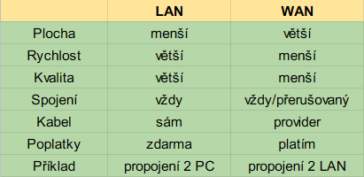

## Rozhovor o LAN
```diff
- Prvně si řekneme něco o LAN.. hmm..
- Tak začenem tím, že jeho rozsah může být místnost, podlaží, budova... no prostě to je síť která zabírá menší plochu.
+ Lokální sít... No to je vlastně všechno co je mi lokální, poblíž ne?
- Přesně tak! V tom malým rozsahu máš třeba kompl, tiskárnu a mnoho dalších zařízení. 
- A právě lan všechny tyto tvoje zařízení v malém rozsahu propojuje.
+ Aha! Takže LAN propojuje všechny počítači v naší učebně a v kancelářích například tiskárny!
- Dneska ti to nějak pálí!! Je to přesně jak jsi řekl!
- Dále zmíním že zařížení v síti LAN se kdykoliv mohou spojit s ostatními zařízenímy v této LAN síti.
+ Mohou se kdykoliv spojit... OK, to dává smysl!
- Jistě, v LAN síti tomu tak je, ale ve WAN síti tomu tak není.
- To jest hlavní rozdíl, dále poskytuje vetší rychlost a kvalitu spojení.
+ Poskytuje větší rychlost.. No a co je myšleno tou rychlostí?
- No... Asi nejlepší vysvětlení by bylo:"kolik dat může poslat najednou, jakou max. velikost může najednou poslat"
+ Ahaaaa.
+ Dobře. chápu! No a co ta vysoká kvalita přenosu?
- Tím slovem "kvalita" je myšlena "Přesnost, správnost dat".
- Tím pádem čím větší kvalita přenosu, tím mín dostanem ERRORŮ!
- Data vlastně kolují jako elektrický signály uvnitř kabelů, ale i tak když voláme přes pevnou linku tak 
- někdy kvalita hovoru stojí za hovno a blbě ho slyšíme.
+ Jo to je pravda.. U pevný linky koluje v jeho kabelu elektřina..
+ Taky je pravda že někdy u volání dochází k nějakému rušení a hlas druhé osoby zeslábne a skoro ho nejde slyšet..
-Ano! A protože LAN je na krátkou vzdálenost, tak vznik takové chyby se stává jen zřídka.
```
## Rozhovor o WAN
```diff
- No dobře, teď tak nějak víš co to ta LAN je.
- Další na řadě je řeč o WAN!
+ To bude logicky nějaká širší síťová oblast, která bude spojovat různé LAN sítě.
- Přesně tak! 
- Jako příklad takove WANky by jsme si mohli uvést třeba toto:
- Máme nějakou společnost, která se rozhléhá po celé republice.
- Máme hlavní kancelář v Praze, a jednu další v Ostravě.
- Ostravák chce, aby se dostal do databáze kancéláře v Praze.
+ Takže dvě síťe si chcou vyměnovat data...
- Přesně tak, ty náš chytráku!
- Zkráceně, LAN síť v naši kanceláři v Praze a Ostravská LAN síť se nějak potřebují spojit.
+ tsss :P
- V takové situaci se jedna LAN s druhou LAN spojí pomocí WANu.
+ Spojí? Jak se sakra mohou spojit?
+ To je budeme spojovat kabelem jako u dvou počítačů v LAN síti?
- Kabelem se sice spojí, ale ne vlastním.
- K tomuto použijeme už položený kabel nějakým providerem, poskytovatelem připojení.
+ Aha, takže to je například ten STARNET nebo T-MOBILE o kterých tak často slýchám..
- Ano, takže bychom mohli říct, že si od těchto providerů "půjčíme","nájmeme" kabely pro náš přenos.
+ Hmmm, pujčím si kabel od providera a pošlu přes něj data.. 
+ To už začíná znít jako ten internet kterej znám.
- No vlastně bych mohl říct, že i samotnej INTERNET je WAN.
- V předchozím příkladě to bylo z Ostravy do Prahy, Internet spojuje LANky po celém světě.
+ ???
+ Muj počítač se na internet připojit umí i když nemá LANku ??
- ... Spíš by jsi měl o tom přemýšlet jako že tvůj počítač je LAN síť o jednom zařízení.
- Trochu o tom popřemýšli, a pak pochopíš že to není zas tak šílená myšlenka.
+ "šílená myšlenka"...
- Možná by ti pomohl tento bláznivý výrok:
- "Provider tě nespojí s okolím, ve skutečnosti se staneš součástí jedné velké lanky samotného providera!". 
- No ve skutečnosti to tedy jedna velká LAN není ale..
+ " šílená myšlenka"...
- Furt jen šilená myšlenka? Je to skutečnost, ale to je jedno.
- To je obecně řečeno charakteristika WANu. 
- Prvně si prostě musíš pronajmout kabel.
- U LANu si všechny kabely zařizuješ a propojuješ sám na sebe, u WANu musíš platit poplatky providerovi...
+ ..Já mám doma nepřetržité připojení takže jsem připojenej 24/7.
- AAaa, v dnešní době jsou takové připojení častá, např. ISDN nebo ADSL...
- Většina společností má nepřetržité připojení...
- No a pro lidi jako jsi ty, má WAN určitě také nepřetržité připojení.
+ Ano, to jsi zmínil u vysvětlení LAN, 「LAN dokáže být vždy připojen」.. Souhlasím!
- Hm.. Mimoto, ISDN má normálně nejvyšší rychlost 128Kb/s. ADSL má 8Mb/s.
- Když použijeme optickej kabel tak výjímečně dosáhneme vysokých rychlostí, ale v zásadě je WAN pomalejší než LAN.
+ To je pravda.. Ve školní LANce se data na sousedícím PC objeví instantně, ale školní internet je strašne pomalej..
- Ve srovnání s minulostí se situace zlepšila, ale i tak je WAN linka více náchylná na výskyt chyb než je LAN.
+ Hm. Hm.
+ Takže když to shrneme tak porovnání LAN a WAN může vypadat takto:
```

## Rozhovor o síťařských pojmech
```diff
- Měli bychom si prvně asi vysvětlit časté pojmy které se budou vyskytovat.
+ Ano, když by jsi řekl nějaký neznámý pojem tak by byl jen zmatek.
- Ano, už i při normálním vysvětlení se udělá v hlavě jen zmatek..
+ 😭
- Takže například. Jsi v situaci kdy sestavuješ LAN síť.
- Počítač, tískarny, je jedno co.
- Pro připojení jsi si tedy koupil kabel a nějaké síťové zařízení.
- Co budeš dělat dál?
+ Propojím je.
- Správná odpověd.
- Dál uděláš co?
+ Dál.. Je použiju?
- U Macintoshe by to šlo ale..
- Bohužel, firma má nějaký systém pro opravu chyb, takže to takhle nepůjde.
+ A co tedy budu dělat??
- Měl by jsi o tom popřemýšlet takto:
- Když jeden telefon vola s druhým, pak jak telefonní zařízení tak telefoní linka si předem udělá nějakou dohodu s providerem(pronajmou si kabel).
- Takže teď jsi připojený s druhým telefonem. Můžete spolu v takové situaci komunikovat?
+ ..Nemůžeme?
- Tak poslouchej, osoba v druhým telefonu na tebe bude mluvit jakým jazykem?
+ ..Jakým jazykem. No, česky ne?
- Aha, takže ty budeš mluvit s osobou z Burkina Faso taky česky?
+ Kde to vůbec je? Burkina Faso.
- Hlavní je, že když jsi jako první v telefonátu řekl "Dobrý den", tak jsi vlastně určil pravidlo "Budeme mluvit česky".
+ Jistě.
- Takže když zahájíš přenos, tak mezi sebou a oponentem musíš nastavit určitý pravidlo. Jestli nikdo nic neřekne, tak nikdo neví jakým jazykem máte mluvit.
+ Takže si z toho mám odvodit, že to spojení nebude tak jednoduchý.
```
### Rozhovor o protokolu
```diff
- Přesně tak, takovým způsobem se při komunikaci používá pravidlo zvané protokol.
+ Protokol... ?
+ To je ta populární konspirační teorie o židech!
- Ne, to si pleteš s 「Protokoly sionských mudrců」.
- Vidím že o takových věcech víš hodně..
+ Děkuji :)
- Já tě nechválím!!
+ Ahah..
- ...
- Vraťme radši se k původnímu tématu.
- Protokolů muže být X typů. Liší se pro každou situaci a potřebu.
- Nejznámější z nich je TCP/IP.
+ Tísípí aipí... To už jsem někde slyšel.
- Jasný že jo. V internetu je to de facto standartní protokol.
- Od teď do konce lekce budu mluvit výhradně o tomto důležitém protokolu.
+ Nemůžu se dočkat.
- Mimo jiné, dalšími protokoly jsou např. IPX/SPX nebo NetBEUI.
+ Ehé, těch protokolů je strašně hodně.
- Ano, teď je mainstream TCP/IP, ale i samotnej TCP/IP se zkládá z mnoha protokolů.
+ Hmm.
- Takže jsme si vysvětlily dnešní pojem "Protokol", tento pojem je důležitý, tak si ho zapamatuj.
- Mimochodem, ještě bych chtěl aby jsi si zapomatoval jeden pojem zvaný bandwith.
```
### Rozhovor o bandwithu
```diff
+ Bendwif?
- Česky se tomu říká "Šířka pásma".
- Tento pojem se často využívá při vysvětlování funkcí kabelů a jejich standartů.
- Je to vlastně rozdíl mezi nejvyšší a nejnižší frekvencí => šířka pásma.
- Mimochodem, v dnešní době udává rychlost přenosu dat.
+ Tak proč to nemůžu prostě nazvat "rychlost přenosu dat"?
- To už jdeme velmi podrobně do detailů.
- rozsah frekvencí je velký => mohu použít vysoké frekvence => Rychlost přenosu dat je rychlá
+ Hm.. mimochodem rychlost přenosu dat je tedy co?
- Jaké množství dat může poslat za jednotku času
- Normálně se používá definice:"Kolik bitů může poslat za 1 sekundu?".
+ To je ten "bps" pojem že?
- Ano, možná by ti pomohlo, kdyby jsi o tom přemýšlel takto:
- Šířka pásma (neboli bandwith) je jako rozsah silnice.
+ "Rozsah silnice"?..
- Ano, šířka pásma může být buď široká, nebo úzká, používaná nebo nepoužívaná.
- Teď jsi představ auto který jede po silnici jako auto který veze nějaké množství dat.
- Jestli je šířka silnice velká, pak v určitým čase může projét více aut.
- V tomto určitém čase je silný provoz, takže rychlost provozu bude menší.
+ ?? To vůbec nechápu.
- Například si představ šířku silnice, kde za minutu projede jen 5 aut.
- Teď si představ silnice tak širokou, že jí dokáže za minutu projét 10 aut.
- Teď, kdyby chtělo těmito silnicemi projét 50 aut, pak by výsledek byl, že první silnicí projeli za 10 minut a druhou za 5 minut.
- To je 2x víc než u silnice s menší šířkou.
+ Aha, když se na to podívám z tohoto pohledu tak to dává smysl.
- Jestli je pro daný množství čas přenosu krátký => pak je rychlost přenosu dat rychlá.
- Takže zkráceně: Šířka velká => rychlost přenosu dat velká
+ Jasně, a když bude menší, tak rychlost přenosu dat bude pomalejší.
- Poslední dobou se hodně mluví o Širokopásmové připojení(broad-band) 
- a o Úzkopásmové připojení(narrow-band).
+ Neznamená to, jestli se používá bandwith nebo nepoužívá?
- Například situace kdy máme velké data.
- Když si představíme velké data jako velký auto, tak by zabíralo 2 pruhy silnice.
- V takovém případě by se mělo ještě jedno auto vejít do pruhu, ale nevejde protože velký auto zabírá oba pruhy.
+ Sice si neumím představit auto který by zabíralo 2 pruhy, ale určitě by se tam nevešlo druhý auto.
- Máš jen slabou představivost..
- Hlavní je, že tato data využívají příliš moc šírky. V tomto smyslu se ptáme jestli použít nebo nepoužít bandwith.
+ 「Tyto data jsou velký, takže použijeme bandwith!」, v takovým kontenxtu ne?
- Přesně tak, od teď si tyto pojmy zapamatuj.
+ Rozumím.

```